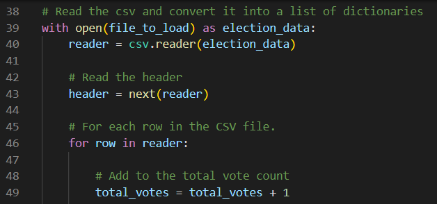
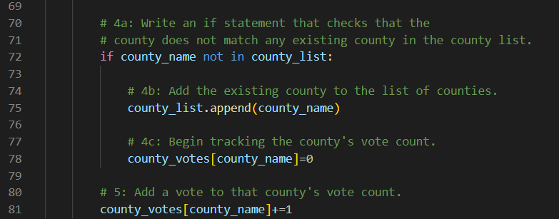
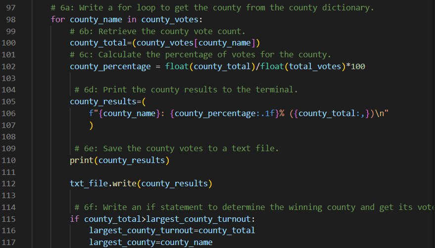
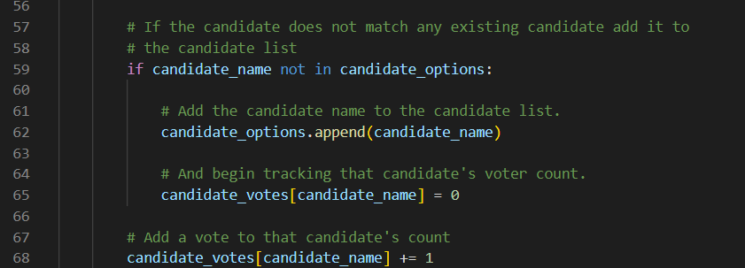
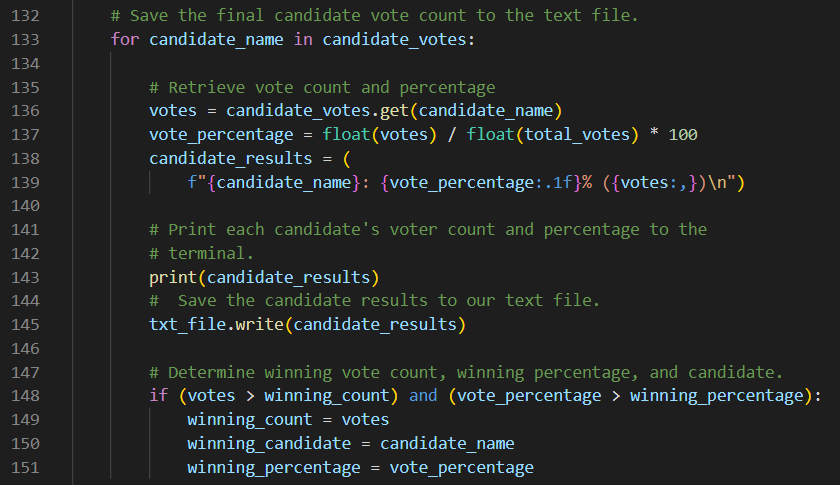

# Election Analysis

## Overview of Election Audit
A Colorado Board of Elections employee has requested an election audit of a recent local congressional election. The following tasks need to be reviewed to complete the audit.

1. Calculate the total number of votes cast.
2. Get a complete list of candidates who received votes.
3. Calculate the total number of votes each candidate received.
4. Calculate the percentage of votes each candidate won.
5. Determine the winner of the election based on popular votes.\
6. Get a complete list of counties who participated in the election.
7. Calculate the total number of votes supplied by each county.
8. Calculate the percentage of votes supplied by each county.
9. Determine the largest county based on registered voters who participated in the election.

## Resources
- Data Source: election_results.csv
- Software: Python 3.10.4, Visual Studio Code 1.66.2

## Summary
The analysis of the election show that:
- There were 369,711 votes cast in the election.
- The candidates were:
    - Charles Casper Stockham
    - Diana DeGette
    - Raymon Anthony Doane
- The candidate results were:
    - Charles Casper Stockham received 23.05% of the vote and 85,213 votes.
    - Diana DeGette received 73.81% of the vote and 272,892 votes.
    - Raymon Anthony Doane received 3.14% of the vote and 11,606 votes.
- The winner of the election was:
    - Diana DeGette, who received 73.81% of the vote and 272,892 votes.
- The counties that participated in the election were:
    - Arapahoe
    - Denver
    - Jefferson
- The amount of ballots from each county were:
    - Arapahoe county contributed 24,801 ballots which was 6.7% of the total vote.
    - Denver county contributed 306,055 ballots which was 82.8% of the total vote.
    - Jefferson county contributed 38,855 ballots which was 10.5% of the total vote.
- The largest county was:
    -  Denver county, which contributed 306,055 ballots These comprised 82.8% of the ballots.

## Election-Audit Results
### Total Votes in the Election
<!-- How many votes were cast in this congressional election? -->
There were 369,711 votes cast in the congressional election. This value was determined by having a 'for' loop run through each row in the 'election_results.csv' file and tally each ballot that was cast. A picture of the code used can be found below.

#### Total Votes Code

<!-- (44-48) -->

### Election Data by County
<!-- Provide a breakdown of the number of votes and the percentage of total votes for each county in the precinct. -->
<!-- Which county had the largest number of votes? -->
The three counties which participated in the election were Denver, Jefferson, and Arapahoe counties. The county with the most voters was Denver county. It comprised 82.8% of the vote with 306,055 ballots cast. The second largest county was Jefferson county, which supplied 10.5% of the votes with its 38,855 ballots. The smallest county was Arapahoe, which comprised 6.7% of the votes with 24,801 ballots cast.
These values were obtained from the 'election_results.csv' file by creating a conditional statement which selected the name of the county on each ballot and appended the county into a list if it was not already present. 
In a separate dictionary (consisting of Key:Value pairings made from County Name:County Votes) the County Votes values were then set to equal 0. And as the code cycled through each row, that value was increased by 1 if the County Name was matched in column 2 of that row.
A picture detailing the code used to find each county's vote count can be found below.

#### County Votes Code

<!-- (69-80) -->

After obtaining the vote count for each county it was further necessary to obtain that result as a percentage of the total votes in the election. To find this percentage, each entry in the County Votes dictionary was referenced in a new 'for' loop to obtain the total votes for a county. That value was then divided by the total votes (369,711) and reformatted as a percentage.
To find the county with the most votes, the same 'for' loop was utilized. For this calculation an empty integer and string variable were made to hold values for the vote count of the largest county, and the name of the largest county. As the 'for' loop ran through the dictionary, it checked if the current county had a vote count larger than the previous counties. If the vote count was the highest in the list so far, then the empty variables stored the value and key from that entry of the dictionary. This code returned the known value that Denver county had the largest voter turnout with its 306,055 ballots.
The described code can be found in the picture below.

#### Largest County Code

<!-- (96-115) -->

### Election Data by Candidate
<!-- Provide a breakdown of the number of votes and the percentage of the total votes each candidate received. -->
The candidates in the election were Diana DeGette, Charles Casper Stockham, and Raymon Anthony Doane. The candidate with the highest vote total was Diana DeGette who recieved 73.8% of the votes. This value represents the 272,892 ballots which were cast for Rep. DeGette. The first runner-up was Charles Casper Stockham. The 23.0% of the votes that Mr. Stockham earned represents 85,213 ballots. Finally the candidate with the least votes was Raymon Anthony Doane. Mr. Doane recieved 3.1% of the votes, which represents 11,606 ballots.
The code to find these values followed a similar pathway to the code used to breakdown the results by county above. In the 'election_results.csv' file a conditional statement was created to select the names of unique candidates and add them into a list if the name was not already present.
Then in a separate dictionary (consisting of Candidate Name:Candidate Votes for the Key:Value pairings) the Candidate Votes were set equal to 0. And as the code cycled through each row, that value was increased by 1 if the Candidate Name was found in column 3 of that row.
A picture detailing the code used can be found below.

#### Candidate Votes Code

<!-- (56-67) -->

<!-- Which candidate won the election, what was their vote count, and what was their percentage of the total votes?  -->

After obtaining the vote count for each candidate it was further necessary to obtain that result as a percentage of the total votes in the election. To find this percentage, each entry in the Candidate Votes dictionary was referenced in a new 'for' loop to obtain the total votes for a county. That value was then divided by the total votes (369,711) and reformatted as a percentage.
To find the candidate with the most votes, the same 'for' loop was utilized. For this calculation an empty integer and string variable were made to hold values for the vote count of the leading candidate, and the name of the largest candidate. As the 'for' loop ran through the dictionary, it checked if the current candidate had a vote count larger than the previous candidates. If the vote count was the highest in the list so far, then the empty variables stored the value and key from that entry of the dictionary. This code returned the known value that Rep. Diana DeGette won the election with 272,892 (73.8%) of the votes.
The described code can be found in the picture below.

#### Winning Candidate Code

<!-- (132-151) -->

## Election-Audit Summary
Even in a larger election this code would still be capable of finding the same information on candidates and county data, assuming it is linked to a similar .csv file as the one used for this audit. It would still gather all of the unique entries from the 2nd and 3rd columns in the .csv file and create a list, dictionary, and results summary similar to the products created for this audit.

Depending on the desired outcomes of the audit, the code could also be modified to account for the following additional factors:
* Ballot Measures and other election results
* Election data coming from separate counties/districts

To address the first point, it is important to keep in mind that most general elections have additional ballot measures including elections for other local government officials and ballot initiatives and referendums. To count these results the code could be modified in the following way:

* Create an empty list and dictionary before the initial 'for' loop
* Create an empty 'winning_result' string and 'winning_percentage' variable equal to 0.
* In the 'for' loop, append the relevant unique vote results (i.e. Candidate Names or Yes/No) into the empty list
* Link the dictionary to this list, with the vote results as the Key. Add 1 to the value associated with that key.
* Create a new 'for' loop that runs through the entries in the dictionary.
* Set a variable to find the value associated with each key in the dictionary.
* Divide that value (as a float) with the total votes in the election to obtain a 'value percentage'.
* Check whether the 'value percentage' is larger than the current 'winning_percentage'. If so, then set this value as the new winning percentage, and its associated key as the 'winning_result'.

Another point that may need to be addressed is the larger turnout and voting system associated with statewide and national elections. In these larger elections, the single file used here (representing Colorado's 1st District) would need to be used in conjuction with the results from the six other congressional districts. To count all of these results in the same code the following modifications could be made:

* Have a distinct name to reference each file which will need to be read (i.e. instead of "file_to_load", reference "file_to_load_1")
* Set up a 'for' loop to run through "file_to_load_1", "file_to_load_2", etc.
* In a nested 'for' loop, run the original 'for' loop for "file_to_load_1" (lines 38-81)
* Close the current "file_to_load" and advance the next iteration of the "file_to_load" through the 'for' loop
